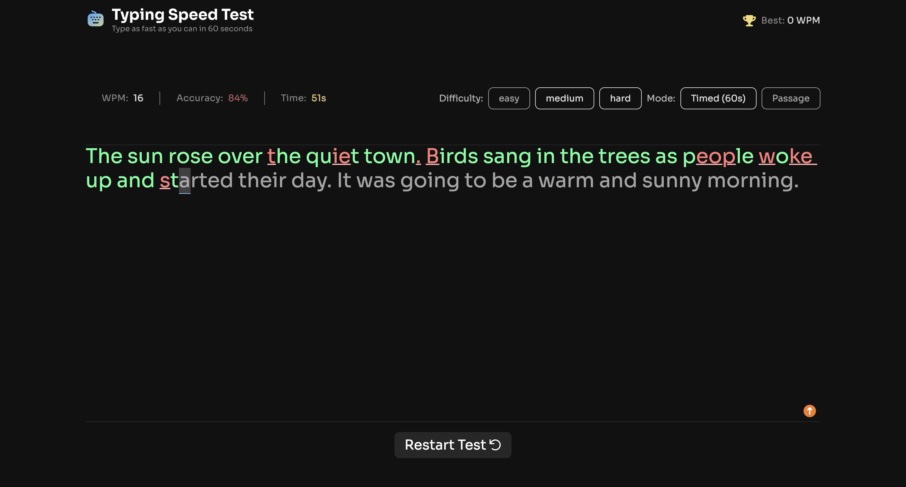

# Typing Speed Test



A fast and focused typing practice app with real-time WPM, accuracy tracking, and persistent high scores.

## Welcome! 👋

This project is built to demonstrate practical frontend engineering skills in a small but complete product.

### What This Project Shows

- Building a clean, interactive UI with real-time feedback
- Managing state clearly for typing flow, timing modes, and scoring
- Persisting user progress with localStorage
- Writing maintainable, readable React + TypeScript code

### Collaboration Mindset

I treat this repository as team-ready work:

- Clear component boundaries and predictable state updates
- Small, focused commits with meaningful messages
- Ongoing README improvements so another developer can onboard quickly

## The challenge

The goal of this project is to build a typing speed test app that feels smooth to use, is easy to understand in code, and stays close to the provided design.

From an implementation side, I focused on predictable state flow, real-time feedback while typing, and clean component boundaries so the feature logic is easy to follow.

Passages are stored in a local `data.json` file and selected by difficulty, which keeps content management simple and makes behavior easy to test.

In practical terms, this is what the app supports:

#### Core Controls

- Start a test by clicking the start button or by clicking the passage and typing
- Select a difficulty level (Easy, Medium, Hard) for passages of varying complexity
- Switch between "Timed (60s)" mode and "Passage" mode (timer counts up, no limit)
- Restart at any time to get a new random passage from the selected difficulty

#### Typing Feedback

- See real-time WPM, accuracy, and time stats while typing
- See visual feedback showing correct characters (green), errors (red/underlined), and cursor position
- Correct mistakes with backspace (original errors still count against accuracy)

#### Results and Progress

- View results showing WPM, accuracy, and characters (correct/incorrect) after completing a test
- See a "Baseline Established!" message on their first test, setting their personal best
- See a "High Score Smashed!" celebration with confetti when beating their personal best
- Have their personal best persist across sessions via localStorage

#### UI and Responsiveness

- View the optimal layout depending on their device's screen size
- See hover and focus states for all interactive elements

### Data Shape

The `data.json` file stores passages grouped by difficulty. Each entry uses the following structure:

```json
{
  "id": "easy-1",
  "text": "The sun rose over the quiet town. Birds sang in the trees as people woke up and started their day."
}
```

| Property | Type   | Description                                                               |
| -------- | ------ | ------------------------------------------------------------------------- |
| `id`     | string | Unique identifier for the passage (e.g., "easy-1", "medium-3", "hard-10") |
| `text`   | string | The passage text the user will type                                       |

### Behavior Notes

- **Starting the test**: The timer starts when the user types or clicks the start button. Clicking into the passage and typing also starts the test.
- **Timed mode**: The app runs a 60-second countdown. The test ends when time reaches 0 or when the passage is completed.
- **Passage mode**: The timer counts up with no limit. The test ends only after the full passage is typed.
- **Error handling**: Incorrect characters are highlighted in red with an underline. Backspace allows corrections, but earlier mistakes still affect accuracy.
- **Result states**:
  - First completed test: "Baseline Established!" sets the initial personal best.
  - New personal best: "High Score Smashed!" with confetti animation.
  - Normal completion: "Test Complete!" with encouragement text.

### Persistence

Personal best score persists across sessions using `localStorage`. When a user beats their high score, the new value is saved and shown on later visits.

### Want some support on the challenge?

[Join our community](https://www.frontendmentor.io/community) and ask questions in the **#help** channel.

## Where to find everything

If you want to understand the project quickly, these are the main files and folders to check:

- `src/` contains the app code and component logic
- `public/images/` contains static images used by the app and README preview
- `src/utils/data.json` contains typing passages grouped by difficulty
- `src/index.scss` and component style files define the visual design

If you want pixel-level alignment with the original design system, the Figma file is available through [Frontend Mentor Pro](https://www.frontendmentor.io/pro).

## Using AI coding assistants

This repository includes helper files for AI tools:

- `AGENTS.md` describes how assistants should guide work in this project
- `CLAUDE.md` points Claude-based tools to the same instruction set

You do not need to configure anything manually. Most tools pick these files up automatically.

I use AI as a support tool for brainstorming, review, and refactoring suggestions, then validate and implement decisions myself.

## Next steps

Potential improvements I'm considering:

- Theme support (dark/light mode) with persistent preference storage
- Add multiple test durations (15s, 30s, 60s, 120s)
- Custom passage upload for targeted practice
- Create shareable result cards for social media

## Getting started

The project is set up with Vite, React, TypeScript, and Sass:

```bash
npm install
npm run dev
```

The app loads passages from `src/utils/data.json` and stores user high scores in browser localStorage. No backend required.

## Deployment

The app is production-ready and can be deployed to any static hosting service. I recommend:

- [Vercel](https://typing-speed-test-eight-pi.vercel.app) - seamless GitHub integration, instant previews on PRs

Build the app with `npm run build` to create an optimized production bundle in `dist/`.

## About this README

This README is written to show recruiters and teammates:

- What the project is and why it exists
- How to run it locally and understand the code
- The engineering approach (clear state, small hooks, readable components)
- Where to find everything

It avoids AI-generated or overly generic phrasing so readers know this is actual project experience, not a template.

## Feedback and questions

If you have questions about the code or find issues, feel free to open a GitHub issue or discussion.

If you find this project useful for learning or reference, sharing it with others is always appreciated.
